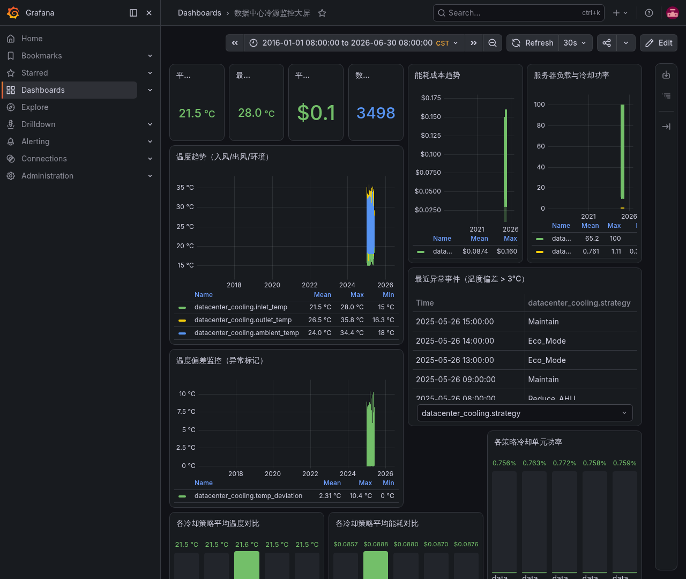

# 工业温控时序监控系统

基于 **InfluxDB v1 + Grafana + Mosquitto**（TIG 栈）的工业温度监控方案，支持实时异常检测与多渠道告警推送。

> **30 秒一键部署**，Grafana 仪表盘自动加载，开箱即用。



---

## 项目结构

```
industrial-monitoring/
├── docker-compose.yml              ← 核心：一键启动所有服务
├── .env.example                    ← 环境配置模板（复制为 .env）
├── Makefile                        ← 快捷命令
├── LICENSE                         ← MIT
│
├── grafana/
│   └── provisioning/               ← Grafana 自动配置
│       ├── datasources/datasource.yml  → 自动连接 InfluxDB
│       └── dashboards/dashboard.yml    → 自动加载仪表盘
│
├── influxdb/
│   └── init.iql                    ← 首次启动自动建库
│
├── mosquitto/
│   └── config/mosquitto.conf       ← MQTT Broker 配置
│
├── dashboards/
│   └── datacenter-monitoring.json  ← 23面板工业冷源监控大屏
│
├── scripts/
│   ├── seed-data.py                ← 模拟传感器数据生成器
│   ├── anomaly-detector.py         ← 异常检测（固定阈值+3σ）
│   └── import_transformer_oil.py   ← 真实变压器油温数据集导入
│
└── skills/                         ← Hermes Agent 一键部署技能
```

---

## 数据集

| 测量表 | 来源 | 记录数 | 温度范围 |
|--------|------|-------|---------|
| `datacenter_cooling` | 模拟生成（5种冷却策略） | ~2,000 | 15~28°C |
| `transformer_oil` | ETDataset（真实电网） | 139,360 | -4.2~58.9°C |

---

## 部署

### 前置条件

- Docker + Docker Compose
- Python 3.8+

### 方式一：一键部署

```bash
git clone https://github.com/bahua123/industrial-monitoring.git
cd industrial-monitoring

# 启动所有服务 + 导入模拟数据
bash scripts/setup.sh
```

### 方式二：分步操作

```bash
# 1. 启动容器
docker compose up -d

# 2. 导入模拟数据（约 2000 条）
python3 scripts/seed-data.py

# 3. 可选：导入真实变压器油温数据集（~14 万条）
python3 scripts/import_transformer_oil.py
```

### 访问

| 服务 | 地址 | 说明 |
|------|------|------|
| **Grafana** | `http://localhost:3000` | 默认 admin / admin |
| **InfluxDB** | `http://localhost:8086` | API 端点 |
| **MQTT** | `localhost:1883` | 传感器数据入口 |

> **⚠️ 首次部署后请立即修改 Grafana 和 InfluxDB 默认密码！**

---

## 仪表盘

### 数据中心冷源监控大屏

包含 **23 个面板**，覆盖：

- **统计卡片** — 平均温度、最高温度、能耗、数据总量
- **温度趋势** — 入风/出风/环境温度曲线
- **能耗分析** — 能耗成本趋势 & 各策略对比
- **负载监控** — 服务器负载与冷却功率关系
- **异常检测** — 温度偏差红线标记 + 异常事件表
- **策略评估** — 5 种冷却策略温控/能耗/能效对比
- **变压器油温** — 双区域趋势、负载关联、区域对比

---

## 异常检测

由 Hermes Cron 驱动，支持两层检测：

| 层级 | 方式 | 说明 |
|------|------|------|
| 第一层 | 固定阈值 | 入风 >40°C、油温 >50°C、负载 >95% 等硬规则 |
| 第二层 | 动态 3σ | 取 7 天历史数据均值 ±3 倍标准差，自动适应季节变化 |

检测到异常后通过 Telegram / 微信推送告警。

### 快速测试

```bash
INFLUX_HOST=127.0.0.1:8086 python3 scripts/anomaly-detector.py
```

---

## Makefile 命令

```bash
make up        # 启动全部服务
make down      # 停止全部服务
make logs      # 查看日志
make status    # 查看服务健康状态
make seed      # 导入模拟数据
make import    # 导入真实数据集
make setup     # 一键部署
```

---

## 资源占用

| 组件 | 内存 | 磁盘 |
|------|------|------|
| InfluxDB v1 | ~60 MB | ~15 MB |
| Grafana | ~384 MB | ~51 MB |
| Mosquitto | ~2.5 MB | ~0 MB |
| **合计** | **~447 MB** | **~66 MB** |

适合 1C2G 低配 VPS 部署。

---

## 技术栈

- **时序数据库**：InfluxDB v1（查询延迟 <10ms）
- **可视化**：Grafana（23 面板自动 provisioning）
- **消息队列**：Mosquitto MQTT（传感器数据管道）
- **异常检测**：Python + 统计方法（双检测层）
- **告警推送**：Hermes Agent → Telegram / 微信
- **部署**：Docker Compose（开箱即用）

MIT License. Copyright (c) 2025 bahua.